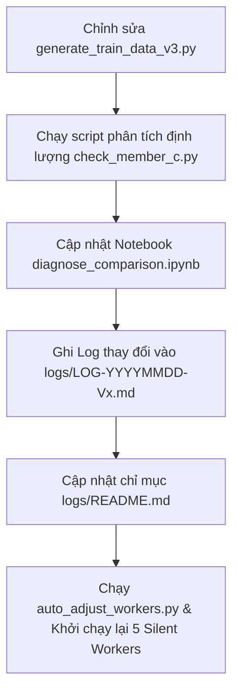

# 🔄 AGENT WORKFLOW & SYNCHRONIZATION STANDARD OPERATING PROCEDURE (SOP)

> **QUY NẮC BẮT BUỘC DÀNH CHO AI AGENT**: File này quy định rõ các bước và file liên quan **BẮT BUỘC THỰC HIỆN ĐỒNG BỘ** sau mỗi hành động chỉnh sửa code, cấu hình hoặc prompt trong dự án Viettel Race 2026.

---

## 📌 QUY TRÌNH 1: KHI THAY ĐỔI PROMPT HOẶC LOGIC SINH DỮ LIỆU (`generate_train_data_v3.py`)

Khi Agent thay đổi Prompt, khung độ dài, cấu trúc JSON hoặc logic trích xuất entity:

### Các bước đồng bộ bắt buộc:
1. **Chạy Phân Tích Định Lượng**:
   * Thực thi script `check_member_c.py` (hoặc script kiểm tra tương ứng) trên toàn bộ dữ liệu mới sinh ra để thu thập các chỉ số: Độ dài trung bình (Word count), Tỷ lệ Position Alignment, Mật độ nhãn thực thể, và Số lượng Assertions (`isNegated`, `isHistorical`, `isFamily`).
2. **Cập nhật Notebook Diagnostics (`diagnose_comparison.ipynb`)**:
   * **Cập nhật mã chạy**: Đảm bảo thư mục dữ liệu mới (ví dụ `GEN_C_DIR`) có trong mã nguồn của Notebook.
   * **Cập nhật Báo cáo Markdown (Mục 5)**: **BẮT BUỘC** viết lại phần Nhận xét & Đánh giá định lượng ở cuối file Notebook theo số liệu mới nhất.
3. **Ghi Nhật Ký Thay Đổi (Changelog trong `logs/`)**:
   * Tạo file log mới theo chuẩn: `logs/LOG-YYYYMMDD-V{x.y}-{TÊN_TÍNH_NĂNG}.md`.
   * Ghi rõ: Ngày giờ, Tình trạng dữ liệu trước khi sửa, Lý do thay đổi, Chi tiết các file đã sửa, và Kết quả kỳ vọng.
   * Cập nhật liên kết file log vào [logs/README.md](file:///d:/AI%20Race/Viettel_Race_2026/logs/README.md).
4. **Khởi chạy lại Workers**:
   * Chạy `taskkill /F /IM python.exe /IM pythonw.exe` để tiêu diệt các Worker cũ.
   * Khởi chạy lại `Long_folder/run_v3_background.bat`.

---

## 📌 QUY TRÌNH 2: KHI THAY ĐỔI API KEYS HOẶC MODELS (`models_registry.json`, `key_manager.py`, `.env`)

Khi Agent thêm/bớt API Keys, thay đổi ưu tiên Model, hoặc phát hiện Model bị decommissioned:

### Các bước đồng bộ bắt buộc:
1. **Cập nhật `models_registry.json`**:
   * Đặt `isUsed: true` và `priority: 1` cho các mô hình sống tốt nhất.
   * Đặt `is_active: false` và `isUsed: false` cho các mô hình đã bị nhà cung cấp khai tử.
2. **Chạy Auto-Worker Tuner (`auto_adjust_workers.py`)**:
   * **BẮT BUỘC** chạy `python Long_folder/custom_scripts/auto_adjust_workers.py`.
   * Script này sẽ tự động tính toán trần an toàn dựa trên số tài khoản sống và khống chế trần **5 Workers (Sweet Spot)**.
   * Script sẽ tự động đồng bộ lại mã nguồn của tất cả 3 file launcher `.bat` (`run_v3_member_C.bat`, `run_v3_member_A.bat`, `run_v3_background.bat`).
3. **Chạy Health Check Khái quát (`refresh_keys.py`)**:
   * Chạy `python Long_folder/custom_scripts/refresh_keys.py` để quét lại 100% sức khỏe API keys và models.

---

## 📌 QUY TRÌNH 3: KHI KẾT THÚC CÔNG VIỆC VÀ COMMIT GIT

Trước khi trả lời cho Người dùng:
1. Kiểm tra 100% không còn file rác temporary trong root.
2. Chạy `git add` các file log, notebook, và code vừa chỉnh sửa.
3. Commit với thông điệp rõ ràng (ví dụ: `git commit -m "docs: add changelogs v5.1 and update diagnose_comparison.ipynb"`).
