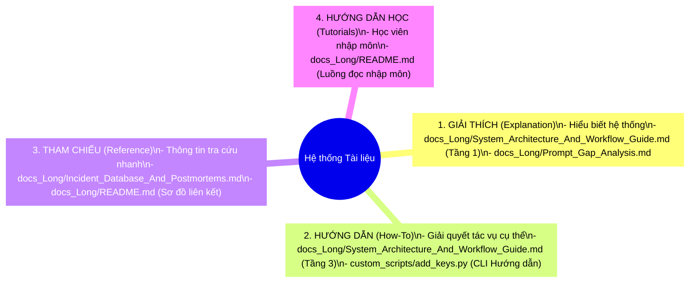

# 📝 NGUYÊN TẮC TỔ CHỨC TÀI LIỆU DỰ ÁN (DOCUMENTATION STRUCTURE & PRINCIPLES)

> **Dự án:** Viettel AI Race 2026 - Nhận diện Thực thể & Chuẩn hóa Mã Y khoa  
> **Áp dụng chuẩn thiết kế:** Diátaxis Technical Authoring Framework  
> **Mục tiêu:** Đảm bảo hệ thống tài liệu luôn khoa học, rõ ràng, dễ bảo trì và dễ tra cứu cho cả Lập trình viên và AI Agent.

---

## 🏛️ 1. KHUNG TỔ CHỨC DIÁTAXIS (DIÁTAXIS FRAMEWORK)

Hệ thống tài liệu của dự án được phân tách rõ ràng thành 4 loại hình tài liệu theo cấu trúc của Diátaxis, tránh việc trộn lẫn giữa lý thuyết và hướng dẫn thực hành:

### 1.1 Giải thích (Explanation - Hướng tới Sự hiểu biết)
* **Đặc điểm:** Thảo luận về kiến trúc hệ thống, lý do đưa ra các quyết định thiết kế (ADRs) và tri thức tích lũy.
* **Tệp đại diện:** 
  * [docs_Long/System_Architecture_And_Workflow_Guide.md](file:///d:/AI%20Race/Viettel_Race_2026/docs_Long/System_Architecture_And_Workflow_Guide.md) *(Tầng 1: Tổng quan & ADRs)*
  * [docs_Long/Prompt_Gap_Analysis.md](file:///d:/AI%20Race/Viettel_Race_2026/docs_Long/Prompt_Gap_Analysis.md) *(Phân tích khoảng cách dữ liệu)*

### 1.2 Hướng dẫn thực hành (How-To Guides - Hướng tới Tác vụ cụ thể)
* **Đặc điểm:** Các chỉ dẫn từng bước một (1-Click, dòng lệnh CLI) giúp người dùng hoàn thành một mục tiêu cụ thể.
* **Tệp đại diện:**
  * [docs_Long/System_Architecture_And_Workflow_Guide.md](file:///d:/AI%20Race/Viettel_Race_2026/docs_Long/System_Architecture_And_Workflow_Guide.md) *(Tầng 3: Hướng dẫn chạy 3 luồng, Thêm Key)*

### 1.3 Tham chiếu (Reference - Hướng tới Phục vụ Tra cứu)
* **Đặc điểm:** Danh mục, mô tả kỹ thuật, bảng tra cứu lỗi, cấu trúc file hoặc CSDL.
* **Tệp đại diện:**
  * [docs_Long/Incident_Database_And_Postmortems.md](file:///d:/AI%20Race/Viettel_Race_2026/docs_Long/Incident_Database_And_Postmortems.md) *(CSDL Nhật ký lỗi & RCA)*

### 1.4 Hướng dẫn học (Tutorials - Hướng tới Quá trình học tập)
* **Đặc điểm:** Luồng dẫn dắt người mới bắt đầu thiết lập môi trường và chạy thử mẫu đầu tiên.
* **Tệp đại diện:**
  * [docs_Long/README.md](file:///d:/AI%20Race/Viettel_Race_2026/docs_Long/README.md) *(Bản đồ chỉ đường và luồng đọc nhập môn)*

---

## 🔗 2. QUY TẮC THAM CHIẾU VÀ LIÊN KẾT (HYPERLINKING RULES)

Để đảm bảo các AI Agent và lập trình viên có thể nhảy nhanh tới đúng file và dòng code cần sửa, dự án áp dụng các tiêu chuẩn liên kết Markdown nghiêm ngặt sau:

1. **Liên kết Clickable tuyệt đối:** Tất cả các đường dẫn file trong tài liệu phải sử dụng giao thức `file:///` với đường dẫn tuyệt đối hoặc tương đối có định dạng dấu xuyệt xuôi `/` (kể cả trên hệ điều hành Windows).
   * *Đúng:* `[key_manager.py](file:///d:/AI%20Race/Viettel_Race_2026/custom_scripts/key_manager.py)`
   * *Sai:* `key_manager.py` hoặc `d:\AI Race\Viettel_Race_2026\custom_scripts\key_manager.py`
2. **Liên kết dòng code cụ thể:** Khi tham chiếu tới một đoạn code hoặc hàm cụ thể trong file, bắt buộc phải sử dụng mã định danh dòng `#L[start]-[end]`.
   * *Ví dụ:* `[key_manager.py:L165-172](file:///d:/AI%20Race/Viettel_Race_2026/custom_scripts/key_manager.py#L165-L172)`
3. **Đặt tên liên kết rõ ràng:** Không bọc liên kết trong các ký tự backtick (`` ` ``) để tránh làm vỡ định dạng liên kết của trình soạn thảo.
   * *Đúng:* [key_manager.py](file:///d:/AI%20Race/Viettel_Race_2026/custom_scripts/key_manager.py)
   * *Sai:* [`key_manager.py`](file:///d:/AI%20Race/Viettel_Race_2026/custom_scripts/key_manager.py)

---

## 🛡️ 3. NGUYÊN TẮC BẢO VỆ TÀI NGUYÊN & HYGIENE DỰ ÁN

1. **Phân vùng Tài liệu riêng biệt:** Toàn bộ các file tài liệu hướng dẫn bắt buộc phải được đặt trong thư mục [docs/](file:///d:/AI%20Race/Viettel_Race_2026/docs/) và được gitignore nếu chứa các thông tin bảo mật nhóm.
2. **Chặn rò rỉ mã bảo mật:** Không bao giờ ghi trực tiếp API Key hoặc thông tin cá nhân vào tài liệu. Mọi API Key phải được quản lý qua [custom_scripts/master_keys.json](file:///d:/AI%20Race/Viettel_Race_2026/custom_scripts/master_keys.json) (đã cấu hình chặn trong file [.gitignore](file:///d:/AI%20Race/Viettel_Race_2026/.gitignore)).
3. **Tính nhất quán giữa Code và Tài liệu:** Khi sửa đổi logic cốt lõi trong code (ví dụ: chuyển đổi cơ chế rate-limit hoặc fallback), lập trình viên có nghĩa vụ cập nhật ngay lập tức các thay đổi đó vào mục giải thích kỹ thuật tương ứng trong tài liệu và ghi nhận mã sự cố vào CSDL Sự cố nếu có.

---

## 🔄 4. QUY TRÌNH CẬP NHẬT TÀI LIỆU KHI CÓ THAY ĐỔI (UPDATE WORKFLOW)

Khi hệ thống có bất kỳ sự thay đổi hoặc bổ sung nào, lập trình viên/AI Agent cần thực hiện cập nhật theo đúng quy trình phân vai sau:

### 4.1 Khi thay đổi/bổ sung API Key
* **Nơi cập nhật:** [custom_scripts/master_keys.json](file:///d:/AI%20Race/Viettel_Race_2026/custom_scripts/master_keys.json) (Dùng tool `add_keys.py`).
* **Hành động bắt buộc:** Chạy lại script quét `refresh_keys.py` để đồng bộ tệp môi trường [.env](file:///d:/AI%20Race/Viettel_Race_2026/.env). Không sửa file `.env` thủ công.

### 4.2 Khi thay đổi logic mã nguồn (Rate-limit, Fallback, Key Rotation)
* **Nơi cập nhật:** [docs/System_Architecture_And_Workflow_Guide.md](file:///d:/AI%20Race/Viettel_Race_2026/docs/System_Architecture_And_Workflow_Guide.md)
* **Hành động bắt buộc:** 
  * Cập nhật các quyết định thiết kế kiến trúc mới (mục 1.3 - ADRs).
  * Vẽ lại hoặc cập nhật luồng xử lý trên sơ đồ Mermaid (mục 2.1) nếu luồng dữ liệu thay đổi.

### 4.3 Khi tinh chỉnh Prompt / Thuộc tính bệnh án / Nhãn NER
* **Nơi cập nhật:** [docs/Prompt_Gap_Analysis.md](file:///d:/AI%20Race/Viettel_Race_2026/docs/Prompt_Gap_Analysis.md)
* **Hành động bắt buộc:** Ghi nhận lý do thay đổi và đánh giá tác động đối với chất lượng dữ liệu.

### 4.4 Khi phát sinh lỗi hệ thống / Crash luồng / Lỗi API từ nhà cung cấp
* **Nơi cập nhật:** [docs/Incident_Database_And_Postmortems.md](file:///d:/AI%20Race/Viettel_Race_2026/docs/Incident_Database_And_Postmortems.md)
* **Hành động bắt buộc:** Tạo một mục sự cố mới có mã định danh tăng dần `INC-260728-NN`, phân tích nguyên nhân gốc (RCA), và ghi chú dòng code đã được khắc phục.

### 4.5 Khi thêm mới tệp tin Script / File Batch Launcher
* **Nơi cập nhật:** [docs/README.md](file:///d:/AI%20Race/Viettel_Race_2026/docs/README.md)
* **Hành động bắt buộc:** Thêm đường dẫn clickable của file mới vào phần "Bản đồ tham chiếu file code" kèm mô tả ngắn gọn về chức năng của tệp đó.
