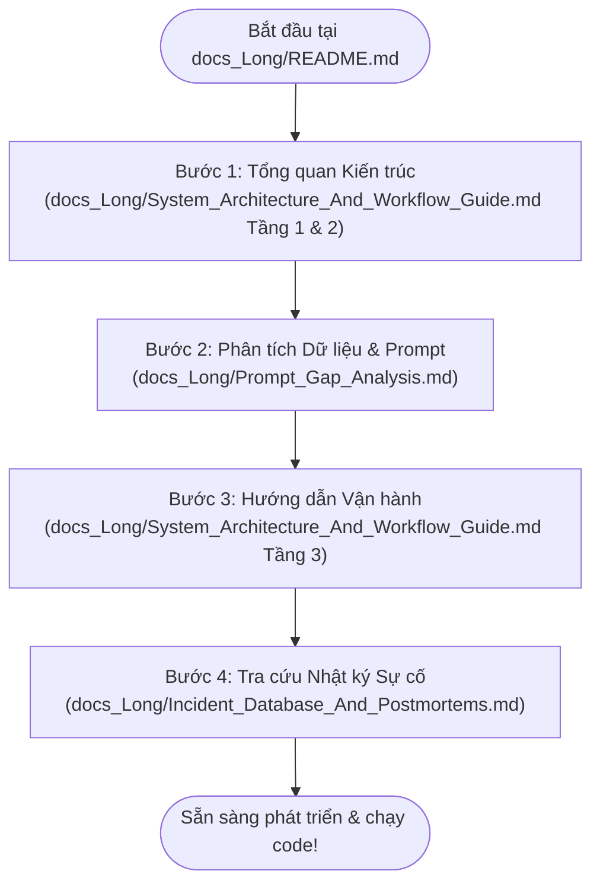

# 🗺️ BẢN ĐỒ TÀI LIỆU & LUỒNG ĐỌC HƯỚNG DẪN (DOCUMENTATION ROADMAP & INDEX)

> **Dự án:** Viettel AI Race 2026 - Nhận diện Thực thể & Chuẩn hóa Mã Y khoa  
> **Áp dụng chuẩn thiết kế:** Diátaxis Navigation System  
> **Vai trò:** Trạm điều hướng trung tâm (Single Entry Point) cho Lập trình viên & AI Agent  

---

> [!IMPORTANT]
> **HƯỚNG DẪN CHO AI AGENT & DEVELOPER MỚI:**  
> Chào mừng bạn tham gia dự án! Trước khi thực hiện bất kỳ hành động nghiên cứu, viết code, sửa file hay cấu hình nào, bạn **BẮT BUỘC phải đọc tài liệu này trước tiên**. Đây là bản đồ chỉ đường giúp bạn nắm bắt toàn bộ kiến trúc và các tệp tham chiếu mà không làm xáo trộn cấu trúc dự án.

---

## 🚦 LUỒNG ĐỌC TÀI LIỆU (READING FLOW)

Để nhanh chóng nắm bắt dự án một cách khoa học, hãy đọc các tài liệu theo đúng 4 bước dưới đây:

---

## 🗂️ HỆ THỐNG PHÂN TẦNG TÀI LIỆU (DOCUMENTATION HIERARCHY)

Dự án tổ chức tài liệu theo 4 tệp tin cốt lõi, có tính liên kết và tham chiếu chéo lẫn nhau:

### 1. [Bản đồ tài liệu trung tâm (docs_Long/README.md)](file:///d:/AI%20Race/Viettel_Race_2026/docs_Long/README.md)
* **Nội dung:** Giới thiệu tổng quan hệ thống tài liệu, sơ đồ luồng đọc và bản đồ liên kết các tệp.
* **Mục đích:** Giúp lập trình viên/AI Agent định vị nhanh vị trí tài liệu cần đọc mà không phải tìm kiếm thủ công.

### 2. [Kiến trúc hệ thống & Vận hành (docs_Long/System_Architecture_And_Workflow_Guide.md)](file:///d:/AI%20Race/Viettel_Race_2026/docs_Long/System_Architecture_And_Workflow_Guide.md)
* **Nội dung:** 
  * **Tầng 1 (Quyết định):** Các Quyết định Kiến trúc (ADRs) về Xoay vòng Key, Chia Folder dữ liệu, Lớp phòng vệ API.
  * **Tầng 2 (Triển khai):** Sơ đồ luồng dữ liệu Mermaid chi tiết và danh mục tệp tin chức năng.
  * **Tầng 3 (Vận hành):** Hướng dẫn chạy 3 luồng Sweet Spot (`run_v3_3workers.bat`) và cách thêm API Key mới.
* **Mục đích:** Tài liệu kỹ thuật chính phục vụ vận hành và bảo trì code.

### 3. [Phân tích đánh giá Prompt (docs_Long/Prompt_Gap_Analysis.md)](file:///d:/AI%20Race/Viettel_Race_2026/docs_Long/Prompt_Gap_Analysis.md)
* **Nội dung:** Báo cáo đánh giá khoảng cách giữa dữ liệu thực tế lâm sàng Việt Nam và Prompt sinh dữ liệu y khoa của LLM.
* **Mục đích:** Cải tiến prompt để đảm bảo chất lượng tập dữ liệu sinh ra đạt độ phủ cao nhất và sát với đề thi thực tế.

### 4. [Cơ sở dữ liệu Nhật ký Sự cố (docs_Long/Incident_Database_And_Postmortems.md)](file:///d:/AI%20Race/Viettel_Race_2026/docs_Long/Incident_Database_And_Postmortems.md)
* **Nội dung:** Postmortem chi tiết của từng lỗi kỹ thuật phát sinh (`NameError`, `Rate Limit 429`, `AttributeError`...), phân tích nguyên nhân gốc rễ (RCA) và mã nguồn đã khắc phục để phòng ngừa.
* **Mục đích:** Tra cứu nhanh khi gặp lỗi hệ thống hoặc khi muốn mở rộng nâng cấp mã nguồn.

### 5. [Nguyên tắc tổ chức tài liệu (docs_Long/Documentation_Principles.md)](file:///d:/AI%20Race/Viettel_Race_2026/docs_Long/Documentation_Principles.md)
* **Nội dung:** Định nghĩa các nguyên lý Diátaxis, cấu trúc phân lớp tài liệu, quy định về hyperlinking tuyệt đối `file:///` và nguyên tắc bảo vệ tài nguyên an toàn.
* **Mục đích:** Quy chuẩn hóa cách viết tài liệu của các AI Agent và cộng tác viên để duy trì hệ thống thông tin đồng bộ.

### 6. [Báo cáo Phân tích Tác động Hiệu suất & Chất lượng (docs_Long/Performance_And_Quality_Impact_Analysis.md)](file:///d:/AI%20Race/Viettel_Race_2026/Long_folder/docs_Long/Performance_And_Quality_Impact_Analysis.md)
* **Nội dung:** Phân tích định lượng tác động của Thuật toán Smart Idle-Account (LRU), Đổ hoả lực High-RPD Quota (Gemini 15.4K req/ngày) và Nâng cấp Prompt V5.1/V5.2 tới Tốc độ sinh dữ liệu và Chất lượng NER.
* **Mục đích:** Báo cáo kỹ thuật tổng hợp phục vụ đánh giá hiệu quả tối ưu hóa hệ thống.

---

## 🛠️ BẢN ĐỒ THAM CHIẾU FILE CODE CHÍNH (CODE REFERENCE MAP)

Dưới đây là các file mã nguồn cốt lõi trong thư mục [custom_scripts/](file:///d:/AI%20Race/Viettel_Race_2026/custom_scripts/) mà bạn có thể cần tra cứu khi vận hành hoặc chỉnh sửa:

* **Kho quản lý Model tập trung:** [custom_scripts/models_registry.json](file:///d:/AI%20Race/Viettel_Race_2026/custom_scripts/models_registry.json) — CSDL chứa Metadata toàn bộ AI Models (category, RPM, TPM, RPD, isUsed, is_active, out_of_quota, rpm_delay_seconds).
* **Trình quản lý Key & Model:** [custom_scripts/key_manager.py](file:///d:/AI%20Race/Viettel_Race_2026/custom_scripts/key_manager.py) — Điều phối xoay vòng kép (Account-Level Key Rotation + Model Round-Robin), Hot-Reload cấu hình và đồng bộ trạng thái Quota.
* **Script sinh dữ liệu:** [custom_scripts/generate_train_data_v3.py](file:///d:/AI%20Race/Viettel_Race_2026/custom_scripts/generate_train_data_v3.py) — Script sinh tập tin y khoa chính, tự động đọc Model từ registry và tính toán dãn cách RPM theo giây.
* **Tool quét Key & Model:** [custom_scripts/refresh_keys.py](file:///d:/AI%20Race/Viettel_Race_2026/custom_scripts/refresh_keys.py) — Quét song song sức khỏe API Key (4 luồng), kiểm tra sức khỏe Model và ghi ngược trạng thái vào `models_registry.json`.
* **Tool thêm Key nhanh:** [custom_scripts/add_keys.py](file:///d:/AI%20Race/Viettel_Race_2026/custom_scripts/add_keys.py) — Thêm Key mới vào kho dữ liệu master.
* **Kho lưu trữ Key gốc:** [custom_scripts/master_keys.json](file:///d:/AI%20Race/Viettel_Race_2026/custom_scripts/master_keys.json) — CSDL chứa toàn bộ các API Key y khoa.
* **Script phân chia Folder:** [custom_scripts/reorganize_samples.py](file:///d:/AI%20Race/Viettel_Race_2026/custom_scripts/reorganize_samples.py) — Dọn dẹp phân vùng 500 file/folder.
* **Batch file khởi chạy:** [run_v3_member_C.bat](file:///d:/AI%20Race/Viettel_Race_2026/run_v3_member_C.bat), [run_v3_member_A.bat](file:///d:/AI%20Race/Viettel_Race_2026/run_v3_member_A.bat) — Script khởi chạy 3 Worker CMD song song cho từng phân vùng thành viên.

---

## 💡 Ý TƯỞNG & ĐỊNH HƯỚNG TỚI (PROPOSED ROADMAP & ARCHITECTURAL IDEAS)

### 📌 Kiến trúc Chia riêng luồng chạy theo Mô hình (Model Isolation Architecture)
* **Khái niệm:** Tách biệt tuyệt đối dàn Workers chuyên trách theo từng dòng AI Model (`llama-3.3-70b-versatile`, `qwen/qwen3.6-27b`, `llama-3.1-8b-instant`) thay vì bắt 1 Worker đan xen luân phiên tất cả các models.
* **Lợi ích kỹ thuật cốt lõi:**
  1. **Triệt tiêu 100% Fallback Delay:** Dàn Worker 8B vọt đi với tốc độ 2.0s/mẫu mà không bao giờ bị nghẽn hay phải chờ 10s dãn cách khi Llama 70B dính 429 TPM.
  2. **Tối ưu Pacing độc lập:** Ép Pacing 12.0s/req chuẩn cho Llama 70B (an toàn trần 12,000 TPM) và Pacing 2.0s/req cho Llama 8B (khai thác tối đa trần 14,400 RPD).
  3. **Kiểm soát Tỷ lệ Dữ liệu Vàng (60/40 Split):** Chủ động chia tỷ lệ 60-70% tập train từ 70B/Qwen27B (độ sâu y khoa cao) và 30-40% từ 8B (nhân bản số lượng).

---

## 📝 NHẬT KÝ CẬP NHẬT HỆ THỐNG (SYSTEM CHANGE LOG)

| Phiên bản | Ngày cập nhật | Thành phần nâng cấp | Nội dung thay đổi chi tiết |
| :---: | :---: | :--- | :--- |
| **v6.0** | 2026-07-30 | `groq_runner.py` `run_v3_groq.bat` `refresh_keys.py` `models_registry.json` `generate_train_data_v3.py` | 1. **Groq-Only Smart Runner Engine (`groq_runner.py` & `run_v3_groq.bat`):** Thiết kế bộ chạy chuyên dụng tối ưu hoá cho 35 Groq Keys (12 Tài khoản độc lập). Xoay vòng theo Cấp Tài Khoản (Account-Level) thay vì Key, tích hợp cơ chế Back-Pressure đọc response headers real-time (`x-ratelimit-remaining-tokens`). 2. **Tối ưu Bộ 3 Models Khảo sát (`GROQ_API_ANALYSIS_REPORT.md`):** Tích hợp Top 3 models tối ưu nhất: `#1 llama-3.3-70b-versatile` (1K RPD), `#2 qwen/qwen3.6-27b` (1K RPD) và `#3 llama-3.1-8b-instant` (14.4K RPD/acc = 172.8K req/ngày, thay thế `groq/compound` bị lỗi 413 Payload Limit). 3. **Vượt Tường Lửa Cloudflare & Lỗi Format:** Bổ sung header `User-Agent` chuẩn trình duyệt (vượt HTTP 403 Error 1010). Khắc phục HTTP 400 bằng cách chỉ truyền `response_format json_object` cho dòng Llama. 4. **Xử lý Thẻ Suy Luận Qwen (`<think>`):** Tự động bóc tách và loại bỏ thẻ `<think>...</think>` của model Qwen 3.6 trước khi bóc JSON, triệt tiêu 100% lỗi JSONDecodeError. 5. **Lọc Provider & Reset Cooldown Cũ:** Bổ sung cờ `--provider groq` vào `refresh_keys.py` để quét siêu tốc riêng Groq và tự động làm sạch `key_cooldowns` cũ trong `key_manager_state.json`. |
| **v5.2** | 2026-07-28 | `models_registry.json` `auto_adjust_workers.py` | 1. **Cấu hình Tập trung Hoả lực Gemini Quota Khủng:** Khóa hoàn toàn các dòng `gemini-3-flash` và `gemini-3.6-flash` bị dính trần 20 RPD đỏ của Google. 2. **Tối ưu 100% Hoả lực High-RPD:** Dồn toàn bộ luồng Gemini vào `gemini-3.1-flash-lite` (500 RPD), `gemini-3.5-flash-lite` (500 RPD) và `gemma-4-31b-it` (14,400 RPD!). 3. **Đột phá Sức tải:** Tăng công suất gánh tải Gemini mỗi tài khoản từ 20 requests/ngày lên **15,400 requests/ngày** (> 230,000 req/ngày cho 15 tài khoản). |
| **v5.1** | 2026-07-28 | `generate_train_data_v3.py` `diagnose_comparison.ipynb` `logs/LOG-20260728-V5.1...` | 1. **Nâng trần độ dài Prompt V5.1:** Tăng mức ép độ dài cứng từ `500-750 từ` lên **`600-900 từ`** (tuyệt đối không ngắn hơn 550 từ) để kéo độ dài trung bình toàn tập dữ liệu **$\ge$ 436.7 từ gốc**. 2. **Mô tả chi tiết 5 hệ cơ quan:** Yêu cầu mô tả tỉ mỉ mốc thời gian diễn biến 5-7 ngày trước, liệt kê khám 5 cơ quan và bảng xét nghiệm kèm đơn thuốc. 3. **Cập nhật Notebook Chẩn đoán:** Cập nhật Mục 5 Báo cáo Markdown trong [diagnose_comparison.ipynb](file:///d:/AI%20Race/Viettel_Race_2026/diagnose_comparison.ipynb). |
| **v5.0** | 2026-07-28 | `models_registry.json` `key_manager.py` `refresh_keys.py` `auto_adjust_workers.py` `generate_train_data_v3.py` | 1. **Smart Idle-Account Priority Scheduler (LRU Allocation):** Đánh dấu bận cấp tài khoản (`in_use`) và cấp ưu tiên tài khoản RẢNH HOÀN TOÀN + NGHỈ LÂU NHẤT cho 5 Workers. 2. **Auto Worker Tuner (`auto_adjust_workers.py`):** Tự động tính toán trần an toàn khống chế **5 Workers (Sweet Spot)** và ghi đè tự động 3 file `.bat` launcher (`run_v3_member_C.bat`, `run_v3_member_A.bat`, `run_v3_background.bat`). 3. **Multi-Key Fallback Health Check:** Nâng cấp [refresh_keys.py](file:///d:/AI%20Race/Viettel_Race_2026/custom_scripts/refresh_keys.py) thử qua 5 Key từ 5 Tài khoản khác nhau khi test model, loại bỏ hoàn toàn lỗi đóng băng nhầm 35 Key Groq. 4. **Cập nhật Model Groq 70B:** Kích hoạt `llama-3.3-70b-versatile` làm mô hình 70B chủ lực, tắt các mô hình đã bị Groq khai tử. 5. **Position Alignment 100%:** Sửa `process_and_align()` với `text.strip(" \t\n\r,.;")`. Bổ sung `inject_family` (188 nhãn `isFamily`). |
| **v4.0** | 2026-07-28 | `generate_train_data_v3.py` `scratch/generate_train_data.py` `diagnose_comparison.ipynb` | 1. **Khắc phục độ dài văn bản:** Bắt buộc trường `text` sinh ra đạt **450 - 750 từ** (tiệm cận độ dài gốc 436 từ của Turn 2). 2. **Tăng đa dạng bối cảnh:** Thêm 5 thuộc tính `clinical_context` ngẫu nhiên và nâng `temperature: 0.8`. 3. **Cân bằng nhãn xét nghiệm:** Bắt buộc mô tả cụ thể các xét nghiệm cận lâm sàng (`TÊN_XÉT_NGHIỆM`, `KẾT_QUẢ_XÉT_NGHIỆM`) và tăng tối đa 6-10 nhãn/file. 4. **Bổ sung Notebook Chẩn đoán:** Thêm Mục 5 đánh giá định lượng & chẩn đoán dữ liệu vào [diagnose_comparison.ipynb](file:///d:/AI%20Race/Viettel_Race_2026/diagnose_comparison.ipynb). |
| **v3.0** | 2026-07-28 | `key_manager.py` `generate_train_data_v3.py` | Tích hợp cơ chế xoay vòng Key theo tài khoản (Account-Level Rotation), Pacing Lock 3.0s, Đóng băng Account khi dính 429. |

