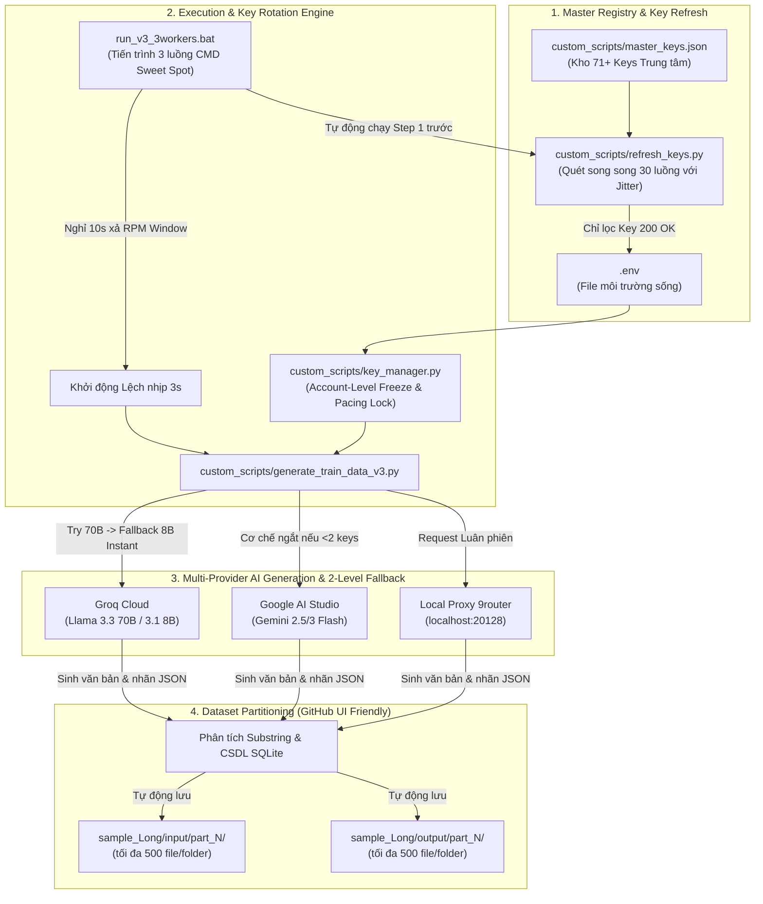

# TÀI LIỆU KIẾN TRÚC HỆ THỐNG & HƯỚNG DẪN VẬN HÀNH TOÀN DIỆN (SYSTEM ARCHITECTURE & WORKFLOW GUIDE)

> **Dự án:** Viettel AI Race 2026 - Nhận diện Thực thể & Chuẩn hóa Mã Y khoa  
> **Áp dụng chuẩn thiết kế tài liệu:** Diátaxis Framework (Explanation, Architecture, How-to, Reference)  
> **Cập nhật gần nhất:** 2026-07-28  

---

## 🌟 TẦNG 1: TỔNG QUAN KIẾN TRÚC & TỔNG HỢP QUYẾT ĐỊNH (HIGH-LEVEL OVERVIEW & ADRs)

### 1.1 Bối cảnh & Mục tiêu Dự án
* **Nhiệm vụ cốt lõi:** Sinh tập dữ liệu huấn luyện y khoa chất lượng cao dạng tổng hợp (Synthetic Data) bao gồm 2.000 mẫu/thành viên (tổng 6.000 mẫu cho toàn đội) để Fine-Tune các mô hình LLM (LoRA/QLoRA) cho bài toán trích xuất thực thể NER và chuẩn hóa mã ICD-10 & RxNorm.
* **Yêu cầu khắt khe:** Văn bản sinh ra phải chân thực như bệnh án lâm sàng Việt Nam, nhãn thực thể `text` phải khớp chính xác 100% từng ký tự (Exact Substring Match) và phân loại ngữ cảnh thuộc tính (`isNegated`, `isHistorical`, `isFamily`).

### 1.2 Tổng hợp Tri thức & Q&A trong Phiên làm việc

#### 🎯 Phân tích con số "Sweet Spot" quy mô dữ liệu
* **Kết luận nghiên cứu:** Ngưỡng **1.000 – 3.000 mẫu/thành viên** chính là **"Sweet Spot" (Điểm vàng)** đối với bài toán NER y khoa.
* **Lý do:**
  * *Dưới 500 mẫu:* Chưa đủ phủ hết 4.346 mã ICD-10 và 348 hoạt chất RxNorm.
  * *1.000 – 3.000 mẫu (Vùng đỉnh F1 Score):* Đạt hiệu suất cao nhất, học đủ các dạng ngữ cảnh và nhiễu (dấu sao `****`, lỗi dính chữ) mà không bị chai lỳ.
  * *Trên 5.000 mẫu:* Điểm F1 bắt đầu đi ngang (Plateau) và có nguy cơ Overfitting theo văn phong rập khuôn của LLM.

#### 🧠 Tiêu chí lựa chọn LLM sinh dữ liệu
1. **Độ am hiểu Tiếng Việt Y khoa:** Cần mô hình hiểu rõ thuật ngữ lâm sàng kết hợp tiếng Việt/Anh (`THA`, `ĐTĐ`, `WBC`, `troponin`). *(Xuất sắc nhất: Gemini 3 Flash & Llama 3.3 70B)*.
2. **Trích xuất Substring chính xác 100%:** Đảm bảo `clinical_text.find(text)` không bị trả về `-1`.
3. **Phân loại thuộc tính ngữ cảnh (Assertions):** Nhận diện chính xác phủ định, tiền sử, bệnh người thân.
4. **Hạn mức API & Tốc độ:** Đánh giá RPM, RPD và Latency. *(Groq LPU tốc độ 1-2s/mẫu là nhanh nhất)*.
5. **Đa dạng phong cách (Ensemble):** Kết hợp nhiều nhà cung cấp (Groq, Gemini, 9router) để tránh rập khuôn văn phong.

> 📄 **Xem chi tiết phân tích khoảng cách Prompt:** [docs_Long/Prompt_Gap_Analysis.md](file:///d:/AI%20Race/Viettel_Race_2026/docs_Long/Prompt_Gap_Analysis.md) — Báo cáo đánh giá chi tiết 10 file test thực tế vs Prompt sinh dữ liệu.

### 1.3 Tổng hợp Quyết định Kiến trúc Cốt lõi (Architecture Decision Records - ADRs)

* **[ADR-01] Kiến trúc Account-Level Round-Robin Key Rotation (`key_manager.py`):**
  * *Bối cảnh:* Sử dụng nhiều API Key trên cùng 1 tài khoản dễ gây dồn lưu lượng và dính Rate Limit 429 toàn bộ tài khoản.
  * *Quyết định:* Nhóm các API Key theo từng tài khoản sở hữu độc lập (`cho_trang`, `cho_do`, `anime_vang`...). Mỗi request sẽ luân phiên chọn Key thuộc **TÀI KHOẢN KHÁC NHAU**. Khi 1 Key dính 429, đóng băng Cooldown Key đó và tự động nhảy sang tài khoản khác.

* **[ADR-02] Phân chia Tập dữ liệu theo Subfolder `part_N` (`reorganize_samples.py`):**
  * *Bối cảnh:* Giao diện GitHub Web bị trần hiển thị tối đa 1.000 file/thư mục, gây ẩn các file mẫu từ 1.001 trở đi.
  * *Quyết định:* Phân chia thư mục `input/` và `output/` thành các thư mục con `part_1`, `part_2`, `part_3`... chứa tối đa 500 file/folder. Cập nhật cả 2 script sinh dữ liệu đọc/ghi tự động vào các `part_N` này.

* **[ADR-03] Tự động hóa Kiểm tra Sức khỏe Kho Key & Sync `.env` (`refresh_keys.py`):**
  * *Bối cảnh:* Việc kiểm tra thủ công từng Key bị nén cooldown hoặc chỉnh sửa file `.env` mất nhiều thời gian.
  * *Quyết định:* Xây dựng kho trung tâm [custom_scripts/master_keys.json](file:///d:/AI%20Race/Viettel_Race_2026/custom_scripts/master_keys.json) lưu 100% keys. Xây dựng tool [custom_scripts/refresh_keys.py](file:///d:/AI%20Race/Viettel_Race_2026/custom_scripts/refresh_keys.py) quét song song 30 luồng kiểm tra sức khỏe và tự động cập nhật đè file [.env](file:///d:/AI%20Race/Viettel_Race_2026/.env) chỉ với các Key sống 100%.

* **[ADR-04] Lớp phòng thủ 3 tầng chống Ban tài khoản:**
  * *Jitter ngẫu nhiên 0.5s - 2.5s* trước khi gửi request.
  * *Sleep ngẫu nhiên 6.0s - 10.0s* giữa các mẫu sinh.
  * *Thời gian Cooldown 429* nâng từ 60s lên 120s.

* **[ADR-05] Kiến trúc Hướng Cấu hình Model Registry & Xoay vòng Model Kép (`models_registry.json`):**
  * *Bối cảnh:* Hardcode tên model `gemini-2.0-flash` dẫn tới lỗi 429 giả (Limit = 0 trên Free Tier), đồng thời việc gọi dồn vào 1 model khiến Quota RPD bị kiệt quệ nhanh chóng.
  * *Quyết định:* 
    1. Tách biệt hoàn toàn Code Logic và Model Metadata thông qua file [models_registry.json](file:///d:/AI%20Race/Viettel_Race_2026/custom_scripts/models_registry.json).
    2. Triển khai cơ chế Xoay vòng Kép (Dual Round-Robin): Xoay cả Account Key và Model khả dụng (`gemini-3.1-flash-lite`, `gemini-3.5-flash-lite`, `gemma-4-31b-it`).
    3. Tự động đồng bộ trạng thái `out_of_quota` và `is_active` ngược lại file JSON và tính toán dãn cách RPM `rpm_delay_seconds` theo từng giây.

---

### 1.4 PHÂN TÍCH CHUYÊN SÂU LỖI RATE LIMIT (429/RPM/TPM/RPD) & GIẢI PHÁP TOÁN HỌC XOAY VÒNG KEY

#### 🔴 1. Phân tích Nguyên nhân Gốc rễ gây ra Lỗi 429 khi chạy Song song

* **429 Cấp Tài Khoản (Account-Level Limit):** Nhiều API Key tạo trên cùng 1 tài khoản (ví dụ 3 key thuộc `CHO_TRANG`) đều dùng chung 1 hạn mức **30 RPM / 6.000 TPM**. Khi 1 key bị 429, việc chuyển sang key thứ 2 cùng tài khoản vẫn bị 429.
* **Kiệt quệ RPM từ Ping Test Bước 1:** Tool quét key bắn 71 request cùng lúc làm ngốn hết 30 RPM window của 1 phút. Khởi động Worker cày ngay ở giây thứ 0 sẽ làm chạm trần RPM tức thì.
* **Lệch pha lưu lượng giữa các Provider:** Nếu Gemini chỉ có 1 Key sống trong `.env` nhưng chế độ `auto` chia 50% lưu lượng sang Gemini, 5 Worker song song sẽ dồn 50% request vào đúng 1 Key Gemini duy nhất đó $\rightarrow$ Chạm trần 429 lập tức.
* **Giới hạn Mô hình Preview:** Mô hình `gemini-3-flash-preview` bị trần nghiêm ngặt **15 RPD/ngày**, dễ cạn kiệt hơn so với các dòng ổn định.

#### 🛡️ 2. Các Cơ chế Phòng thủ & Xử lý Kỹ thuật Đã triển khai

1. **Đóng băng 429 Cấp Tài Khoản (Account-Level Freeze):**
   * Trong [custom_scripts/key_manager.py](file:///d:/AI%20Race/Viettel_Race_2026/custom_scripts/key_manager.py#L165-L172): Khi 1 key dính 429, hệ thống tự động đóng băng **TOÀN BỘ các Key thuộc cùng Tài khoản đó** trong 120s, giúp luồng ngay lập tức nhảy sang Tài khoản khác (`CHO_DO`, `CHO_CAT`, `ANIME_VANG`...) mà không lặp lại lỗi rác.

2. **Ngưỡng Tối thiểu 2 Keys cho Chế độ Auto:**
   * Trong [custom_scripts/generate_train_data_v3.py](file:///d:/AI%20Race/Viettel_Race_2026/custom_scripts/generate_train_data_v3.py#L255-L260): Chế độ `auto` chỉ đan xen các Nhà cung cấp có ít nhất 2 Key sống trở lên. Nếu Gemini chỉ có 1 Key, tự động gạt bỏ Gemini để 29 Key Groq (10 tài khoản) gánh tải 100%.

3. **Fallback 2 Cấp Mô hình (Groq 70B $\rightarrow$ 8B Instant):**
   * Trong [custom_scripts/generate_train_data_v3.py](file:///d:/AI%20Race/Viettel_Race_2026/custom_scripts/generate_train_data_v3.py#L223-L237): Nếu model `llama-3.3-70b-versatile` bị dính 429, script tự động chuyển sang `llama-3.1-8b-instant` (hạn mức **14.400 RPD hoàn toàn riêng biệt**) $\rightarrow$ Đảm bảo request trả về `200 OK` lập tức.

4. **Khóa Giãn trễ Pacing Lock (3.0s/Key):**
   * Mỗi Key sau khi cấp phải nghỉ tối thiểu **3.0 giây** mới được cấp tiếp, đảm bảo tần suất tối đa 20 req/phút/key (dưới mốc 30 RPM của Groq).

5. **Tạm dừng 10s Reset RPM Window & Stagger 3s Khởi động:**
   * File [run_v3_3workers.bat](file:///d:/AI%20Race/Viettel_Race_2026/run_v3_3workers.bat) tạm dừng 10s sau bước test sức khỏe để xả sạch đếm lưu lượng, và khởi động các Worker trễ nhau 3s.

#### 📊 3. Phân tích Toán học Số lượng Worker Tối ưu (The 3-Worker Sweet Spot)

* **Chu kỳ 1 mẫu (LLM + SQLite + Sleep 6.5s):** $\approx 11$ **giây/mẫu** $\rightarrow$ Tốc độ 1 Worker: $5.45$ **req/phút**.
* **Tổng tải 3 Workers:** $3 \times 5.45 = \mathbf{16.35\text{ req/phút toàn hệ thống}}$.
* **Tải trên 10 Tài khoản Groq:** Mỗi tài khoản chỉ nhận $1.63$ **req/phút** (chỉ bằng **5% trần 30 RPM**!).
* **Thời gian hoàn thành:** Đúng **~2.0 Giờ** cho 2.000 mẫu với **0% nguy cơ Rate Limit**.

---

## ⚙️ TẦNG 2: TRIỂN KHAI CHI TIẾT & SƠ ĐỒ LUỒNG DỮ LIỆU (IMPLEMENTATION ARCHITECTURE)

### 2.1 Sơ đồ Kiến trúc & Luồng dữ liệu (Mermaid Diagram)



### 2.2 Chi tiết Danh mục Tệp tin & Chức năng

| Loại tệp | Đường dẫn tệp | Chức năng & Vai trò trong hệ thống |
| :--- | :--- | :--- |
| **Kho Key** | [custom_scripts/master_keys.json](file:///d:/AI%20Race/Viettel_Race_2026/custom_scripts/master_keys.json) | Lưu trữ tập trung toàn bộ 71+ API Key của 17 tài khoản (9router, Groq, Gemini). |
| **Tool Refresh** | [custom_scripts/refresh_keys.py](file:///d:/AI%20Race/Viettel_Race_2026/custom_scripts/refresh_keys.py) | Quét song song 30 luồng kiểm tra sức khỏe kho key và tự động ghi đè file `.env`. |
| **Tool Thêm Key**| [custom_scripts/add_keys.py](file:///d:/AI%20Race/Viettel_Race_2026/custom_scripts/add_keys.py) | Công cụ thêm nhanh Key mới vào kho master và tự động refresh `.env` trong 1 dòng lệnh. |
| **Key Router** | [custom_scripts/key_manager.py](file:///d:/AI%20Race/Viettel_Race_2026/custom_scripts/key_manager.py) | Trình điều hướng Account Round-Robin xoay vòng Key & Đóng băng Cấp Tài khoản khi 429. |
| **Generator V3**| [custom_scripts/generate_train_data_v3.py](file:///d:/AI%20Race/Viettel_Race_2026/custom_scripts/generate_train_data_v3.py) | Script sinh dữ liệu V3 tích hợp 2-Level Groq Fallback (70B $\rightarrow$ 8B Instant) & Log minh bạch. |
| **Chia Folder** | [custom_scripts/reorganize_samples.py](file:///d:/AI%20Race/Viettel_Race_2026/custom_scripts/reorganize_samples.py) | Script chia nhỏ tập dữ liệu hiện có thành các subfolder 500 file/thư mục. |
| **Launcher 3 Luồng**| [run_v3_3workers.bat](file:///d:/AI%20Race/Viettel_Race_2026/run_v3_3workers.bat) | File Batch Sweet Spot tự động refresh key, xả RPM 10s và mở 3 luồng CMD cày trong 2 giờ. |
| **Launcher 2 Luồng**| [run_v3_2workers.bat](file:///d:/AI%20Race/Viettel_Race_2026/run_v3_2workers.bat) | File Batch 2 luồng dành cho chế độ chạy chậm siêu an toàn qua đêm. |
| **Cấu hình Git** | [.gitignore](file:///d:/AI%20Race/Viettel_Race_2026/.gitignore) | Cấu hình bảo mật chặn push file `.env`, `custom_scripts/`, `*.bat`, file log và script tạm. |
| **File Môi trường**| [.env](file:///d:/AI%20Race/Viettel_Race_2026/.env) | File lưu trữ các API Key đang sống 100% hiện tại (Đã được `.gitignore` bảo mật). |

---

## 📖 TẦNG 3: HƯỚNG DẪN VẬN HÀNH & XỬ LÝ SỰ CỐ (HOW-TO GUIDES & TROUBLESHOOTING)

### 3.1 Hướng dẫn Vận hành Hàng ngày (1-Click Execution)
Khi bắt đầu phiên làm việc sinh dữ liệu, bạn chỉ cần thực hiện 1 thao tác duy nhất:
1. Nhấp đúp vào file **[run_v3_3workers.bat](file:///d:/AI%20Race/Viettel_Race_2026/run_v3_3workers.bat)** (Chạy 3 luồng Sweet Spot trong 2 giờ).
2. Hệ thống sẽ tự động quét lại sức khỏe toàn bộ kho Key, ghi file `.env` mới, dừng 10s xả RPM window và mở 3 cửa sổ CMD song song cày dữ liệu.

### 3.2 Hướng dẫn Thêm API Key Mới khi Nhận Thêm
Khi bạn tạo thêm tài khoản hoặc có Key mới, chỉ cần gõ 1 dòng lệnh duy nhất trong Terminal:

* **Thêm Key Groq:**
  ```powershell
  python custom_scripts/add_keys.py --provider groq --account acc_moi --keys "gsk_key1..." "gsk_key2..."
  ```
* **Thêm Key Gemini:**
  ```powershell
  python custom_scripts/add_keys.py --provider gemini --account acc_moi --keys "AQ_key1..." "AQ_key2..."
  ```
* **Thêm Key 9router:**
  ```powershell
  python custom_scripts/add_keys.py --provider ninerouter --account acc_moi --keys "sk_key1..."
  ```

### 3.3 Sổ tay Xử lý Lỗi Phổ biến (Troubleshooting Reference)

> 📄 **Xem chi tiết Cơ sở dữ liệu Sự cố & Root Cause Analysis (RCA) chuyên sâu:** [docs_Long/Incident_Database_And_Postmortems.md](file:///d:/AI%20Race/Viettel_Race_2026/docs_Long/Incident_Database_And_Postmortems.md) — Nhật ký ghi nhận chi tiết, mức độ ảnh hưởng, timeline và giải pháp khắc phục triệt để mọi lỗi phát sinh trong phiên làm việc.

#### 🔴 Lỗi 1: `WinError 10061` (Connection actively refused on port 20128)
* **Nguyên nhân:** Server Local Proxy 9router chưa được bật hoặc bị đóng cửa sổ.
* **Cách sửa:** Mở 1 Terminal riêng và gõ: `npx 9router` để khởi động lại server 9router.

#### 🔴 Lỗi 2: `git push origin main` bị từ chối (`rejected - fetch first`)
* **Nguyên nhân:** Trên GitHub remote có commit mới hơn mà máy local chưa pull về.
* **Cách sửa:** Chạy 2 lệnh trong Terminal:
  ```bash
  git pull --rebase origin main
  git push origin main
  ```

#### 🔴 Lỗi 3: `Git Credential Manager` bị đứng ngầm khi push
* **Nguyên nhân:** Windows yêu cầu xác thực OAuth/Token qua popup GUI.
* **Cách sửa:** Chạy lệnh `git push origin main` trực tiếp trong cửa sổ Terminal của VS Code để bấm nút Approve trên popup Windows.

#### 🔴 Lỗi 4: `AttributeError: 'NoneType' object has no attribute 'strip'`
* **Nguyên nhân:** Mô hình LLM trả về cấu trúc JSON bị lỗi hoặc thiếu trường `"text"` (trả về `"text": null` hoặc `None`). Khi chương trình cố gắng gọi `.strip()` trên trường này sẽ gây ra crash chương trình.
* **Cách sửa:** Đã tích hợp lớp bảo vệ Type-safety trong `process_and_align` và `main()`. Chỉ gọi `.strip()` nếu trường trả về là chuỗi thực tế, ngược lại tự động gán là chuỗi rỗng `""` và bỏ qua mẫu lỗi đó một cách êm ái mà không gây sập luồng.
