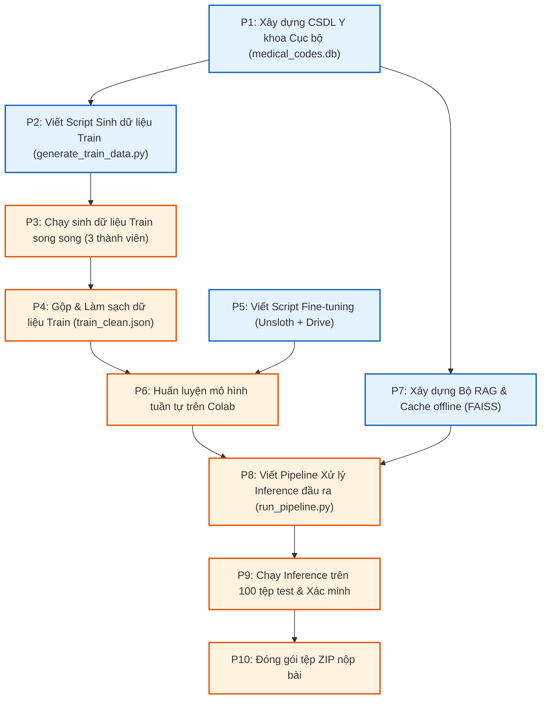

# Bản đồ Lộ trình Tổng thể: Viettel AI Race 2026 (Vòng 1) - Phiên bản Cập nhật

Tài liệu này định hình lộ trình triển khai dự án theo **Thuật toán sắp xếp Topo (Topological Sort)**. Lộ trình này đảm bảo việc tận dụng tối đa khả năng chạy song song và tuân thủ nghiêm ngặt quy định: **Không sử dụng bất kỳ kết nối API bên ngoài nào trong bước chạy Inference (luận suy) trên 100 tệp test để nộp bài.**

---

## 1. Sơ đồ Quan hệ Phụ thuộc (Topological Graph)

---

## 2. Chi tiết Từng Tiến trình (Kèm Định nghĩa Input/Output)

### P1: Xây dựng CSDL Y khoa Cục bộ
*   **Mô tả:** Thu thập danh mục bệnh ICD-10 (tiếng Việt/Anh) và hoạt chất thuốc RxNorm để tạo một cơ sở dữ liệu SQLite offline dùng làm bộ tra cứu nhanh.
*   **Đầu vào (Input):** Danh mục ICD-10 Bộ Y tế Việt Nam, API NIH RxNav (gọi online một lần để thu thập dữ liệu).
*   **Đầu ra (Output):** Tệp cơ sở dữ liệu SQLite cục bộ `medical_codes.db`.

### P2: Viết Script Sinh dữ liệu Train tự động
*   **Mô tả:** Lập trình mã nguồn gọi API mô hình mạnh (GPT-4o) để sinh ca bệnh giả lập và dùng Python Tool để tra cứu tự động mã ICD-10/RxNorm từ `medical_codes.db`.
*   **Đầu vào (Input):** API Key của mô hình mạnh, tệp CSDL `medical_codes.db` (từ P1).
*   **Đầu ra (Output):** Tệp script Python `generate_train_data.py`.

### P3: Chạy sinh dữ liệu Train song song
*   **Mô tả:** 3 thành viên trong nhóm tự chạy script `generate_train_data.py` trên máy riêng theo 3 phân khoa đã chia để sinh dữ liệu thô.
*   **Đầu vào (Input):** Script `generate_train_data.py` (từ P2), phân chia chuyên khoa cho từng người.
*   **Đầu ra (Output):** 3 tệp JSON thô: `train_cardio.json` (Tim mạch), `train_digestive.json` (Tiêu hóa), `train_pediatrics.json` (Nhi khoa).

### P4: Gộp & Làm sạch dữ liệu Train
*   **Mô tả:** Hợp nhất dữ liệu thô từ 3 thành viên, lọc trùng lặp và làm sạch định dạng lỗi.
*   **Đầu vào (Input):** 3 tệp JSON thô (từ P3).
*   **Đầu ra (Output):** Một tệp dữ liệu huấn luyện hợp nhất duy nhất `train_clean.json` (~1000 - 1500 ca bệnh sạch).

### P5: Viết Script Fine-tuning (Chạy song song khi nhóm đang làm P3)
*   **Mô tả:** Lập trình notebook huấn luyện mô hình bằng thư viện Unsloth, tích hợp cơ chế tự động lưu và tải checkpoint từ Google Drive sau mỗi 5-10 bước train.
*   **Đầu vào (Input):** Cấu trúc dữ liệu `train_clean.json`, tài khoản Google Drive để mount lưu checkpoint.
*   **Đầu ra (Output):** Tệp Jupyter Notebook `fine_tune_unsloth.ipynb`.

### P6: Huấn luyện mô hình tuần tự trên Colab
*   **Mô tả:** Chạy huấn luyện mô hình bằng notebook trên Colab free. Đổi tài khoản chạy tiếp từ checkpoint nếu hết thời hạn 2 tiếng.
*   **Đầu vào (Input):** Notebook `fine_tune_unsloth.ipynb` (từ P5), tệp `train_clean.json` (từ P4).
*   **Đầu ra (Output):** Thư mục trọng số mô hình đã huấn luyện (LoRA Weights) lưu trên Google Drive.

### P7: Xây dựng Bộ RAG & Cache offline (Chạy song song khi nhóm đang làm P3)
*   **Mô tả:** Xây dựng cơ chế tìm kiếm vector cục bộ dựa trên mô hình nhúng đa ngôn ngữ `bge-m3` và thư viện tìm kiếm nhanh FAISS trên nền tảng tệp `medical_codes.db` của P1.
*   **Đầu vào (Input):** Tệp CSDL `medical_codes.db` (từ P1).
*   **Đầu ra (Output):** Chỉ mục tìm kiếm vector offline `faiss_index.bin` và bảng Cache ánh xạ nhanh.

### P8: Viết Pipeline Xử lý Inference đầu ra
*   **Mô tả:** Tích hợp mô hình đã fine-tune (P6), bộ định vị vị trí text bằng Python, và bộ RAG/Cache offline (P7) thành một pipeline chạy hoàn toàn offline, không dùng internet/API ngoài.
*   **Đầu vào (Input):** Trọng số mô hình đã train (từ P6), CSDL RAG và Cache (từ P7).
*   **Đầu ra (Output):** Tệp script Python suy luận hoàn chỉnh `run_pipeline.py`.

### P9: Chạy Inference trên 100 tệp test & Xác minh
*   **Mô tả:** Chạy script `run_pipeline.py` trên 100 tệp test và đối chiếu kiểm tra chất lượng kết quả.
*   **Đầu vào (Input):** 100 tệp tin test `.txt`, tệp script `run_pipeline.py`.
*   **Đầu ra (Output):** 100 tệp `.json` kết quả (từ `1.json` đến `100.json`).

### P10: Đóng gói tệp ZIP nộp bài
*   **Mô tả:** Nén các tệp kết quả JSON thành tệp ZIP theo đúng định dạng yêu cầu của BTC.
*   **Đầu vào (Input):** 100 tệp `.json` (từ P9).
*   **Đầu ra (Output):** Tệp nén thành phẩm `submission.zip`.
