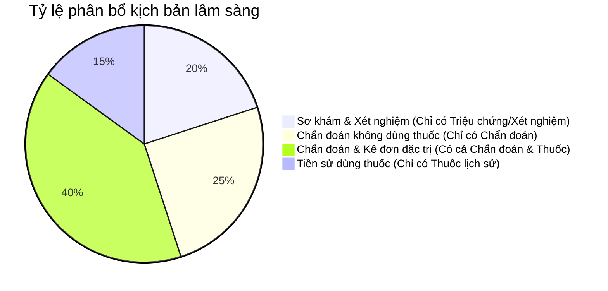

# Kế hoạch Sinh dữ liệu Phân tầng (Phase 2 Generation Plan)

Tài liệu này ghi lại thiết kế kỹ thuật của hệ thống sinh dữ liệu huấn luyện y khoa tiếng Việt tự động cho dự án.

---

## 1. Mục tiêu & Quy mô

*   **Quy mô:** Sinh **2,000 mẫu mỗi thành viên** (tổng số **6,000 mẫu** dữ liệu huấn luyện).
*   **Mục tiêu chất lượng:**
    *   Bảo đảm tính chính xác lâm sàng (Clinical Realism): Thuốc được kê đơn phải phù hợp điều trị cho chẩn đoán bệnh tương ứng.
    *   Bảo đảm bao phủ các bệnh hiếm gặp trong 13,000+ mã ICD-10.
    *   Mô phỏng đúng cấu trúc đa dạng của tệp test thật (gồm bệnh án bán cấu trúc, hỏi đáp diễn đàn, và bài viết giáo dục).

---

## 2. Thiết kế Kịch bản Lâm sàng (Clinical Scenarios)

Dữ liệu sinh ra được phân phối ngẫu nhiên theo tỷ lệ của 4 kịch bản lâm sàng thực tế nhằm đa dạng hóa cấu trúc thực thể, tránh việc mô hình học vẹt "luôn luôn kê đơn thuốc sau chẩn đoán":

### Chi tiết kịch bản:
1.  **Kịch bản 1 (Sơ khám - 20%):** Bệnh nhân khai triệu chứng, được làm xét nghiệm nhưng chưa chẩn đoán bệnh hay kê đơn thuốc. (Thực thể: `TRIỆU_CHỨNG`, `TÊN_XÉT_NGHIỆM`, `KẾT_QUẢ_XÉT_NGHIỆM`).
2.  **Kịch bản 2 (Chẩn đoán không dùng thuốc - 25%):** Bệnh nhân được chẩn đoán bệnh cần mổ ngoại khoa hoặc chỉ cần điều chỉnh sinh hoạt, không dùng thuốc. (Thực thể: `CHẨN_ĐOÁN`).
3.  **Kịch bản 3 (Chẩn đoán & Điều trị nội khoa - 40%):** Có chẩn đoán và đơn thuốc điều trị thích hợp. (Thực thể: `CHẨN_ĐOÁN`, `THUỐC`).
4.  **Kịch bản 4 (Tiền sử dùng thuốc - 15%):** Chỉ ghi nhận bệnh nhân đang uống thuốc dài hạn từ trước (`isHistorical`), không chẩn đoán bệnh đó ở thời điểm khám hiện tại. (Thực thể: `THUỐC`).

---

## 3. Thuật toán Lấy mẫu & Định hướng Lâm sàng (Guided Sampling)

Để giải quyết bài toán thuốc và bệnh phải logic với nhau, chúng tôi sử dụng giải pháp **Bơm Danh mục thuốc hỗ trợ (Supported Formulary injection)**:

1.  **Python chọn bệnh (Đảm bảo phân phối bệnh hiếm):**
    *   70% số mẫu: Chọn ngẫu nhiên 1 mã ICD-10 trong phân vùng của thành viên (Đảm bảo bao phủ bệnh hiếm).
    *   30% số mẫu: Chọn ngẫu nhiên từ 162 bệnh phổ biến (`Thường gập` = "Có").
2.  **Bơm danh sách thuốc vào Prompt:** Danh sách 348 hoạt chất hỗ trợ (lấy từ `rxnorm_mapped.json`) được đính kèm vào prompt gửi Gemini.
3.  **LLM chọn thuốc thông minh:** Gemini tự dùng tri thức y khoa để lựa chọn thuốc thích hợp nhất trong danh sách 348 hoạt chất đó để điều trị bệnh đã chọn ở Bước 1.
4.  **Python đối chiếu offline:** Python nhận tên thuốc do Gemini chọn, tự động dò vị trí ký tự (`position`) trong văn bản thô và tra cứu SQLite offline lấy mã RxNorm chính xác.
