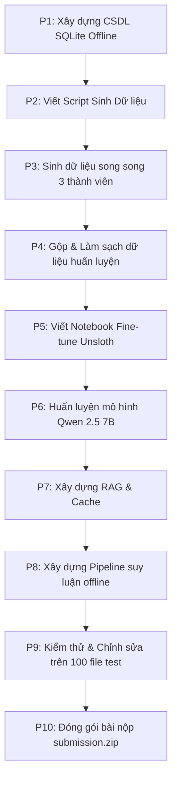

# Lộ trình Phát triển Dự án (Project Roadmap)

Lộ trình này mô tả 10 giai đoạn (từ P1 đến P10) để xây dựng giải pháp trích xuất thực thể y tế tiếng Việt và chuẩn hóa mã ICD-10/RxNorm.

---

## 🗺️ Các Giai đoạn Thực hiện (10-Phase Pipeline)

### 📋 Chi tiết các giai đoạn:

#### P1: Xây dựng CSDL SQLite Cục bộ (`medical_codes.db`)
*   *Mục tiêu:* Chuẩn hóa danh mục thuốc sang tiếng Anh, ánh xạ RxNorm CUI từ API NIH, gộp ICD-10 và RxNorm vào SQLite.
*   *Trạng thái:* **Đã hoàn thành**. Chỉ mục FTS5 tìm kiếm dưới 1ms.

#### P2: Viết Script Sinh Dữ liệu Huấn luyện (`generate_train_data.py`)
*   *Mục tiêu:* Viết script Python tự động hóa việc gọi Gemini API theo 4 kịch bản lâm sàng, lấy mẫu hybrid bệnh hiếm/phổ biến, và tra cứu mã offline.
*   *Trạng thái:* **Đã hoàn thành**.

#### P3: Sinh dữ liệu song song (3 thành viên)
*   *Mục tiêu:* Phân bổ cho 3 thành viên chạy script song song theo phân vùng chương bệnh để tạo ra 6,000 mẫu.
*   *Trạng thái:* **Sẵn sàng thực hiện**.

#### P4: Gộp & Làm sạch dữ liệu (`train_clean.json`)
*   *Mục tiêu:* Viết script gộp các file JSON đơn lẻ từ 3 thành viên, lọc bỏ các mẫu lỗi hoặc trùng lặp, tạo tệp dữ liệu huấn luyện thống nhất.

#### P5: Viết Notebook Huấn luyện (`fine_tune_unsloth.ipynb`)
*   *Mục tiêu:* Viết notebook sử dụng Unsloth để fine-tune mô hình Qwen 2.5 7B Instruct bằng kỹ thuật LoRA/QLoRA.

#### P6: Huấn luyện mô hình tuần tự
*   *Mục tiêu:* Chạy huấn luyện trên Colab/Kaggle, lưu các checkpoint và chọn ra model tốt nhất có khả năng trích xuất thực thể + điền thuộc tính ngữ cảnh (`assertions`).

#### P7: Xây dựng Bộ chỉ mục RAG & Cache offline
*   *Mục tiêu:* Xây dựng bộ tìm kiếm vector (FAISS + bge-m3) kết hợp thuật toán so khớp chuỗi cứng trên SQLite để chuẩn hóa từ thực thể sang mã ứng viên (`candidates`).

#### P8: Viết Pipeline suy luận offline hoàn chỉnh (`run_pipeline.py`)
*   *Mục tiêu:* Ghép nối mô hình Qwen đã fine-tune để trích xuất thực thể và bộ chỉ mục RAG/SQLite để gán mã, xử lý từ văn bản thô `.txt` ra tệp `.json`.

#### P9: Chạy kiểm thử trên 100 file test công khai
*   *Mục tiêu:* Chạy pipeline suy luận trên 100 tệp test, rà soát thủ công các trường hợp lỗi biên, tối ưu hóa prompt/chỉ mục RAG.

#### P10: Đóng gói bài nộp (`submission.zip`)
*   *Mục tiêu:* Đóng gói các tệp JSON kết quả đúng cấu trúc thư mục quy định để nộp lên hệ thống chấm điểm của cuộc thi.
