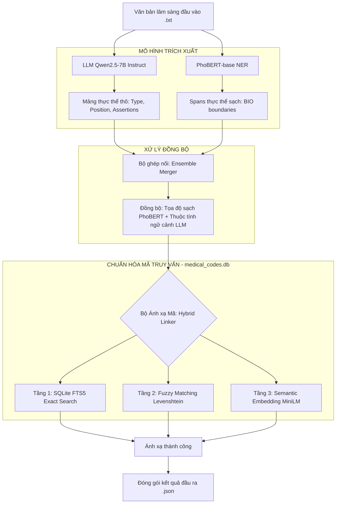

# 📌 LOG-20260730-V6.4: Báo cáo Bàn giao Hợp phần Pipeline & Trạng thái PhoBERT Fine-tune

* **Ngày thực hiện:** `2026-07-30 18:00:00 (UTC+7)`
* **Mã phiên bản:** `V6.4-PIPELINE-DELIVERY`
* **Người thực hiện:** Antigravity (AI Assistant)

---

## 1. Sơ đồ Pipeline Tổng quát (End-to-End Pipeline Architecture)

Dưới đây là sơ đồ kiến trúc Giai đoạn 2 (Ensemble Booster) của hệ thống trích xuất và chuẩn hóa thực thể y khoa:

---

## 2. Trạng thái Fine-tune PhoBERT-NER
*   **Chuẩn bị Dữ liệu (Dataset Preparation):** **ĐÃ HOÀN THÀNH**. 
    *   Đã chuyển đổi 8,223 hồ sơ bệnh án sang dạng nhãn BIO sequence tagging cấp độ token (11 nhãn).
    *   Đã chia tách tỷ lệ 9:1 thành `train_phobert.jsonl` (7,400 mẫu) và `val_phobert.jsonl` (823 mẫu).
    *   Đã ghi cấu hình nhãn tại `label_mapping.json`.
*   **Kịch bản Huấn luyện (Training Script):** **ĐÃ HOÀN THÀNH**.
    *   Đã bàn giao file `train_phobert.py` tích hợp Hugging Face Trainer & seqeval evaluation.
*   **Chạy Huấn luyện (Actual Training):** **CHƯA THỰC HIỆN** (Đã bàn giao cho **Thành viên 2**).
    *   *Hành động tiếp theo:* Thành viên 2 cần chạy lệnh `python train_phobert.py` trên máy GPU của mình để sinh ra bộ checkpoint tối ưu lưu tại thư mục `phobert_ner_model`.

---

## 3. Trạng thái Fine-tune LLM (Qwen2.5-7B)
*   **Chuẩn bị Dữ liệu:** **ĐÃ HOÀN THÀNH**. 8,223 mẫu đã sẵn sàng trong tệp `train_clean.json`.
*   **Chạy Huấn luyện:** **CHƯA THỰC HIỆN** (Đã bàn giao cho **Thành viên 1**).
    *   *Hành động tiếp theo:* Thành viên 1 thiết lập chạy Unsloth LoRA và bật cấu hình checkpoint ngắn (mỗi `5 - 10 steps` lưu một lần) như quy tắc fallback.

---

## 4. Các Hợp phần Pipeline đã bàn giao (Thư mục `/pipeline`)
Mã nguồn cấu trúc pipeline chạy offline đã được bàn giao đầy đủ cho **Thành viên 3** tự phát triển tiếp và tối ưu:

| Tên File | Vai trò & Chức năng | Trạng thái |
| :--- | :--- | :--- |
| [hybrid_linker.py](file:///d:/record_by_me/Viettel_race/pipeline/hybrid_linker.py) | Ánh xạ mã 3 tầng: 1. FTS5 SQLite; 2. Fuzzy Levenshtein (RapidFuzz/difflib); 3. Semantic Cosine Similarity (paraphrase-multilingual). | Đã bàn giao |
| [ensemble_merger.py](file:///d:/record_by_me/Viettel_race/pipeline/ensemble_merger.py) | Gộp thực thể từ LLM và PhoBERT. Tính IoU tọa độ, đồng bộ ranh giới từ sạch của PhoBERT và thừa kế assertions của LLM. | Đã bàn giao |
| [run_pipeline.py](file:///d:/record_by_me/Viettel_race/pipeline/run_pipeline.py) | Module End-to-End chính điều phối: Đọc file `.txt` $\rightarrow$ LLM $\rightarrow$ PhoBERT $\rightarrow$ Ensemble Merger $\rightarrow$ Hybrid Linker $\rightarrow$ Ghi file `.json`. | Đã bàn giao |
