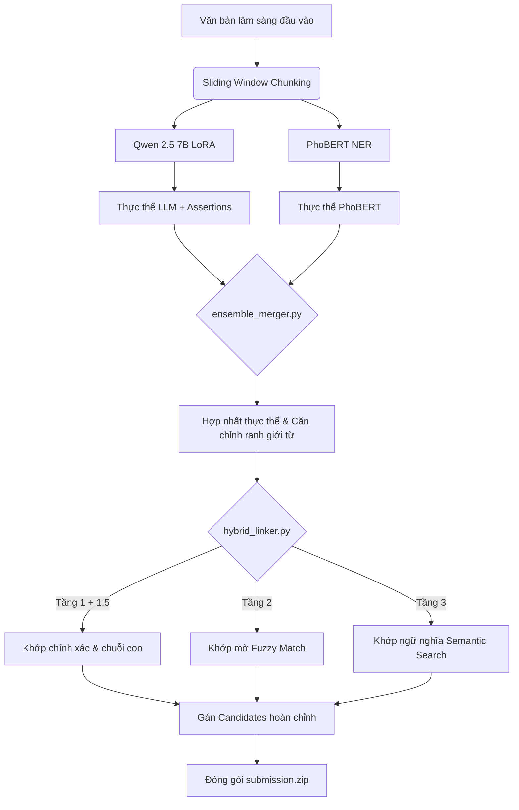

# 🚀 Pipeline Mô hình Y khoa (Medical Entity Recognition & Linking Pipeline)

Thư mục này chứa các thành phần cốt lõi của quy trình suy luận (Inference Pipeline), xử lý hậu kỳ (Post-processing), đối khớp cơ sở dữ liệu y khoa (Medical Linker) và hợp nhất mô hình (Ensemble) cho dự án Viettel AI Race.

---

## 📊 Bản đồ Tổng quan Hợp phần (Component Map)

| Tên Tệp tin | Vai trò chính | Môi trường | Mô hình sử dụng |
| :--- | :--- | :--- | :--- |
| 🌟 [run_kaggle_ensemble_inference.py](file:///D:/AI%20Race/Viettel_Race_2026/pipeline/run_kaggle_ensemble_inference.py) | Script suy luận chính thức (Ensemble Qwen + PhoBERT) | **Kaggle** (Production) | Qwen 2.5 7B LoRA + PhoBERT NER |
| 🏎️ [run_kaggle_inference.py](file:///D:/AI%20Race/Viettel_Race_2026/pipeline/run_kaggle_inference.py) | Script suy luận đơn lẻ (Chỉ chạy Qwen) | **Kaggle** (Production) | Qwen 2.5 7B LoRA |
| 🔀 [ensemble_merger.py](file:///D:/AI%20Race/Viettel_Race_2026/pipeline/ensemble_merger.py) | Logic gộp thực thể theo IoU và phân loại nhãn | Chung | N/A |
| 🔗 [hybrid_linker.py](file:///D:/AI%20Race/Viettel_Race_2026/pipeline/hybrid_linker.py) | Ánh xạ mã y khoa SQLite (ICD-10 & RxNorm) | Chung | SentenceTransformer (Optional) |
| 🤖 [phobert_predictor.py](file:///D:/AI%20Race/Viettel_Race_2026/pipeline/phobert_predictor.py) | Suy luận sliding-window và căn chỉnh token cho PhoBERT | Chung | PhoBERT-base NER |
| ⚙️ [run_pipeline.py](file:///D:/AI%20Race/Viettel_Race_2026/pipeline/run_pipeline.py) | Class điều phối chung cho toàn bộ pipeline | Offline (Local) | Qwen 2.5 7B + PhoBERT |
| 🧪 [merge_submissions.py](file:///D:/AI%20Race/Viettel_Race_2026/pipeline/merge_submissions.py) | Gộp các kết quả dự đoán offline thô của Qwen & PhoBERT | Offline (Local) | N/A |
| 📝 [run_submission.py](file:///D:/AI%20Race/Viettel_Race_2026/pipeline/run_submission.py) | Tiện ích chạy nhanh suy luận PhoBERT offline | Offline (Local) | PhoBERT |

---

## 🔍 Chi tiết từng Thành phần (Detailed File Overview)

### 1. [run_kaggle_ensemble_inference.py](file:///D:/AI%20Race/Viettel_Race_2026/pipeline/run_kaggle_ensemble_inference.py)
* **Chức năng:** Tệp suy luận hợp nhất (Ensemble) tối ưu nhất được thiết kế để chạy trực tiếp trên Kaggle Notebook.
* **Cơ chế hoạt động:**
  * Sử dụng thư viện `unsloth` để tải nhanh và chạy suy luận mô hình ngôn ngữ lớn Qwen 2.5 7B (LoRA Adapter).
  * Tải song song mô hình PhoBERT NER để phân loại token.
  * Chia nhỏ văn bản lâm sàng dài qua cơ chế cửa sổ trượt (Sliding Window) cho cả hai mô hình.
  * Tự động quét và phát hiện các đường dẫn tài nguyên (SQLite DB, adapters, checkpoints) trong `/kaggle/input`.
  * Hợp nhất kết quả bằng **IoU chéo (Intersection over Union)**: ưu tiên ranh giới chính xác của PhoBERT và giữ lại thuộc tính ngữ cảnh của Qwen, chuẩn hóa mã candidates và tự động đóng gói `submission.zip`.

### 2. [run_kaggle_inference.py](file:///D:/AI%20Race/Viettel_Race_2026/pipeline/run_kaggle_inference.py)
* **Chức năng:** Script chạy suy luận đơn lẻ trên Kaggle chỉ sử dụng mô hình Qwen (V4.0/V5.0).
* **Cơ chế hoạt động:** Chạy suy luận sinh văn bản thông qua Unsloth, phân tích cú pháp JSON kết quả đầu ra, căn chỉnh ranh giới từ và gọi bộ chuẩn hóa SQLite để gán mã candidate. Hiện đã được nâng cấp lên bản gộp Ensemble ở tệp trên để tăng mạnh chỉ số Recall.

### 3. [ensemble_merger.py](file:///D:/AI%20Race/Viettel_Race_2026/pipeline/ensemble_merger.py)
* **Chức năng:** Cung cấp hàm `merge_entities` dùng chung để thực hiện gộp (ensemble) các thực thể từ hai nguồn dự đoán khác nhau (như LLM sinh tự hồi quy và BERT gán nhãn token).
* **Cơ chế hoạt động:** 
  * Tính toán chỉ số IoU giữa các khoảng ký tự (character spans) của các thực thể cùng loại.
  * Nếu trùng khớp vượt ngưỡng IoU cấu hình (mặc định $0.5$), hệ thống sẽ lấy tọa độ và ranh giới từ của PhoBERT để bảo toàn độ chính xác vị trí ngữ pháp (Precision/WER), đồng thời kế thừa thuộc tính ngữ cảnh (`isNegated`, `isHistorical`, `isFamily`) từ Qwen.
  * Đồng thời giữ lại các thực thể duy nhất chỉ tìm thấy ở một trong hai mô hình để đạt độ phủ tối đa (Recall).

### 4. [hybrid_linker.py](file:///D:/AI%20Race/Viettel_Race_2026/pipeline/hybrid_linker.py)
* **Chức năng:** Bộ chuẩn hóa mã y khoa đa tầng (`HybridLinker`), thực hiện khớp các thực thể văn bản thô sang mã ICD-10 (Chẩn đoán) và RxNorm (Thuốc) trong cơ sở dữ liệu SQLite `medical_codes.db`.
* **Kiến trúc khớp 3 tầng:**
  * **Tầng 1 (Exact Match):** So khớp chính xác từ ngữ lâm sàng, kết hợp từ điển viết tắt/đồng nghĩa (`_SYNONYMS`) mở rộng (ví dụ: `tha` ➔ `tăng huyết áp`, `g6pd` ➔ `thiếu men g6pd`).
  * **Tầng 1.5 (Substring Match):** Khớp chuỗi con/tiền tố để giải quyết các trường hợp chẩn đoán chung bị đặt tên quá chi tiết trong CSDL ICD-10.
  * **Tầng 2 (Fuzzy String Match):** Sử dụng thuật toán so sánh độ tương đồng chuỗi ký tự thông qua thư viện `rapidfuzz` (hoặc `difflib` fallback).
  * **Tầng 3 (Semantic Search):** Tra cứu ngữ nghĩa thông qua vector nhúng của mô hình `SentenceTransformer` khi các tầng trên thất bại.

### 5. [phobert_predictor.py](file:///D:/AI%20Race/Viettel_Race_2026/pipeline/phobert_predictor.py)
* **Chức năng:** Lớp bao đóng (`PhoBertPredictor`) chuyên trách thực hiện suy luận trên mô hình PhoBERT NER.
* **Tính năng đặc biệt:**
  * Tiền xử lý văn bản để giải quyết các lỗi dính chữ lâm sàng (ví dụ: `bịchảy` ➔ `bị chảy`).
  * Chuẩn hóa Unicode NFC trong quá trình suy luận và tự động khôi phục, căn chỉnh ranh giới ký tự về định dạng Unicode NFD gốc của dữ liệu y tế thông qua `SequenceMatcher`.
  * Áp dụng whitelist/blacklist nghiêm ngặt để lọc bỏ các từ đơn âm tiết bị cắt cụt hoặc nhận diện sai (ví dụ chỉ giữ lại các triệu chứng đơn âm tiết phổ biến như `ho`, `sốt`, `đau`...) và loại bỏ các đơn vị đo lường/liều lượng/hành động lâm sàng.

### 6. [run_pipeline.py](file:///D:/AI%20Race/Viettel_Race_2026/pipeline/run_pipeline.py)
* **Chức năng:** Lớp điều phối pipeline y khoa đầu cuối (`EndToEndPipeline`) được dùng cho môi trường ngoại tuyến (Local/Offline).
* **Cơ chế hoạt động:** Nạp đồng thời cả LLM và PhoBERT thông qua PyTorch truyền thống, gọi bộ liên kết `HybridLinker` để sinh và lưu trữ kết quả cho thư mục kiểm thử cục bộ.

### 7. [merge_submissions.py](file:///D:/AI%20Race/Viettel_Race_2026/pipeline/merge_submissions.py)
* **Chức năng:** Kịch bản tiện ích chạy ngoại tuyến để nạp các kết quả JSON thô đã được sinh sẵn từ Qwen và PhoBERT một cách riêng biệt, sau đó chạy căn chỉnh vị trí ký tự gốc và hợp nhất chúng lại để xuất ra file zip nộp bài.

### 8. [run_submission.py](file:///D:/AI%20Race/Viettel_Race_2026/pipeline/run_submission.py)
* **Chức năng:** Script chạy nhanh để gọi mô hình PhoBERT NER đơn lẻ cục bộ và trích xuất thực thể cho 100 tệp văn bản kiểm thử.

---

## 📈 Quy trình Luồng dữ liệu Suy luận (Inference Dataflow)

